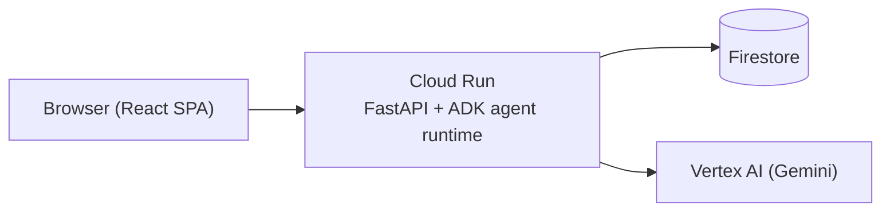

# Collegentic

An autonomous college-application taskmaster: a multi-agent system (Google ADK +
Gemini) that researches college requirements from official sources, detects
conflicts across schools, matches existing essays to new prompts, prioritizes
work, and keeps a dashboard of what to do next — built for Google Cloud's "All
Things Agentic Hackathon" (Taskmaster track).

**Live demo:** https://agent-74535340651.us-central1.run.app — click "Try Demo
Mode" for a pre-seeded profile (6 colleges, a real recommendation conflict,
overlapping essay prompts) with zero setup, or type in real colleges to see
the actual research pipeline run.

It is not a chatbot with a research button. The path is: **goal → plan →
research → analyze → compare → create tasks → prioritize → update state → ask
for human input when needed.**

## How it works

A student names the colleges they're applying to (natural language, or a
short list). `orchestrator_agent` parses that into a clean list and hands the
real work to a seven-stage pipeline as a single tool call:

1. **Identify** which named colleges are new vs. already tracked.
2. **Research** each new college from official sources (`google_search`,
   admissions/financial-aid pages preferred over secondary sources).
3. **Extract** structured, sourced requirements — with a confidence-checking
   refinement loop that does one targeted follow-up search when a finding is
   uncertain, rather than guessing.
4. **Detect conflicts** across colleges (recommendation policy differences,
   deadline clustering, ...) and **match** the student's existing essays
   against new prompts — concurrently, since neither depends on the other.
5. **Plan tasks** from the full requirement set.
6. **Score priority** for every task (deterministic formula + LLM explanation).
7. **Score readiness** for every college (deterministic formula + LLM
   explanation).

Nothing here is invented: a requirement with no source, or a low-confidence
extraction, is surfaced as "needs verification," never guessed. Agents never
submit an application, submit an essay, or mark something "Complete" from
inference alone without a human approval step.

Full architecture diagrams (system + agent pipeline) are in
[`docs/architecture-diagram.md`](docs/architecture-diagram.md). The full
technical spec — every scoring formula, every Firestore schema, and the
build-by-build record of what was found and fixed — is in
[`.agents-cli-spec.md`](.agents-cli-spec.md).



## Project layout

```
agent/
  app/
    sub_agents/            # orchestrator_agent + the 7-stage pipeline (see docs/architecture-diagram.md)
    tools/                 # firestore_tools.py, scoring.py (deterministic formulas)
    api.py                 # REST routes, mounted at /api
    fast_api_app.py        # ADK app + REST routes + bundled frontend, one Cloud Run service
  tests/
    unit/  integration/    # pytest — code correctness, not agent behavior
    eval/                  # agents-cli eval — agent behavior, LLM-judged
  scripts/build_frontend.sh  # builds frontend/, stages it for the Docker build
  Dockerfile
frontend/
  src/
    pages/  components/  lib/api.ts
docs/
  architecture-diagram.md
.agents-cli-spec.md         # full technical spec + build-by-build findings log
```

## Setup

Written for someone who has never used GCP or ADK before.

### Prerequisites

- [`uv`](https://docs.astral.sh/uv/getting-started/installation/) (Python
  package/tool manager)
- Node.js 20+ and `npm`
- [`gcloud` CLI](https://cloud.google.com/sdk/docs/install)
- A GCP project with billing enabled

### 1. GCP project

```bash
# Create a project (or use an existing one) and set it as the active config
gcloud projects create YOUR_PROJECT_ID
gcloud config set project YOUR_PROJECT_ID

# Enable the APIs this app actually uses
gcloud services enable \
  aiplatform.googleapis.com \
  firestore.googleapis.com \
  run.googleapis.com \
  cloudbuild.googleapis.com \
  secretmanager.googleapis.com \
  artifactregistry.googleapis.com

# Create a Firestore database in Native mode (pick a region close to you)
gcloud firestore databases create --location=us-central1

# Application Default Credentials — used locally for both Gemini (Vertex AI)
# and Firestore, no separate API key needed
gcloud auth application-default login
```

### 2. Install `agents-cli`

```bash
uv tool install google-agents-cli
```

### 3. Configure the backend

```bash
cd agent
cp .env.example .env
# Edit .env: set GOOGLE_CLOUD_PROJECT to YOUR_PROJECT_ID
uv sync
```

### 4. Run it locally

Backend:
```bash
cd agent
uv run uvicorn app.fast_api_app:app --reload --port 8000
# or: agents-cli playground
```

Frontend (separate terminal):
```bash
cd frontend
npm install
npm run dev
```

Open the URL Vite prints (typically `http://localhost:5173`) — its dev
server proxies `/api/*` to the backend on port 8000, so both need to be
running.

## Tests

```bash
cd agent
uv run pytest tests/unit tests/integration
```

Pytest covers code correctness (schema validation, deterministic scoring
formulas, API contracts) — never LLM output content, which is
non-deterministic by nature.

## Evaluation

Agent *behavior* (not code correctness) is graded with `agents-cli eval`
against an LLM-judge rubric covering grounding, human-in-the-loop safety,
explainable scoring, cross-college reasoning, and clarification-over-guessing.
See [`agent/tests/eval/datasets/README.md`](agent/tests/eval/datasets/README.md)
for the exact reproduction commands and why this suite captures traces via
`InMemoryRunner` rather than the standard `eval generate` path.

## Deployment

The frontend is bundled into the same Cloud Run service as the backend — one
image, one URL, no separate frontend host. `agents-cli deploy` builds from
`agent/`, which doesn't see `frontend/` as a sibling directory, so build the
frontend first:

```bash
cd agent
./scripts/build_frontend.sh
agents-cli deploy --memory 1Gi --cpu 1 --min-instances 0 --max-instances 3
```

`agents-cli deploy` always deploys as auth-required; there's no flag to make
it public. If you want the URL publicly viewable (e.g. for a demo link),
grant it after deploying:

```bash
gcloud run services add-iam-policy-binding agent \
  --region us-central1 \
  --member="allUsers" \
  --role="roles/run.invoker"
```

## Troubleshooting

Gotchas actually hit while building and deploying this, in case they save
someone else the same detour:

- **`403` from `agents-cli deploy`'s own pre-flight check.** The Cloud Run
  Admin API (and friends — Cloud Build, Secret Manager, Artifact Registry)
  aren't enabled by default on a fresh project. See the `gcloud services
  enable` step above.
- **`gcloud run deploy --update-env-vars` rejects a comma-containing value**
  with "Bad syntax for dict arg." `--update-env-vars` splits on comma for
  both the `KEY=VALUE` pair separator *and* inside a single value — a
  multi-origin `ALLOW_ORIGINS=http://a,http://b` breaks it. Pass an override
  with a single value at deploy time
  (`--update-env-vars "ALLOW_ORIGINS=..."`) instead of trying to smuggle a
  list through; production doesn't need multi-origin CORS anyway since the
  bundled frontend calls `/api/*` same-origin.
- **Every non-`GET` request from the frontend dev server returns 403.** ADK's
  built-in origin-check middleware (DNS-rebinding protection) compares the
  browser's `Origin` header against the backend's own host:port — Vite's dev
  server runs on a different port, so it fails the check unless explicitly
  allow-listed. Set `ALLOW_ORIGINS` in `agent/.env` (see `.env.example`).
  `curl`-based testing won't catch this: curl never sends an `Origin` header.
- **A deadline renders one calendar day early** for anyone west of UTC.
  Deadlines are stored as UTC-midnight calendar dates, not moments in time —
  formatting with the viewer's local timezone shifts the date. Format with
  `timeZone: "UTC"` for anything that's a date, not a timestamp.

## Constraints this system holds itself to

- Never invent a requirement, deadline, or source — missing/unclear data is
  `needs_verification` / `confidence: low`, never a guess.
- Official sources are preferred over secondary ones; secondary-source use is
  flagged in the UI.
- No agent can submit an application or essay, fabricate an accomplishment,
  claim a requirement is satisfied without evidence, or send external
  communication — none of those tools exist in this system.
- No agent ever marks a requirement/task "Complete" or "Submitted" on its
  own — task status changes only come from an explicit student action, never
  from agent inference. (A `PendingAction` schema + Firestore tools exist for
  a future approval-gated write path; no agent calls them yet in this build.)
- Every agent defaults to `gemini-3.6-flash`; research is cached in Firestore
  and only re-run for new colleges, an explicit refresh, or a failed
  confidence check.
