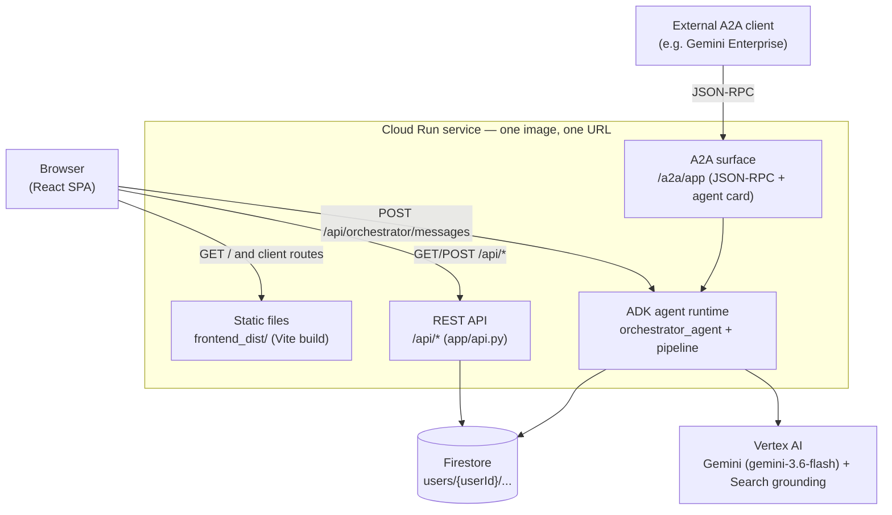
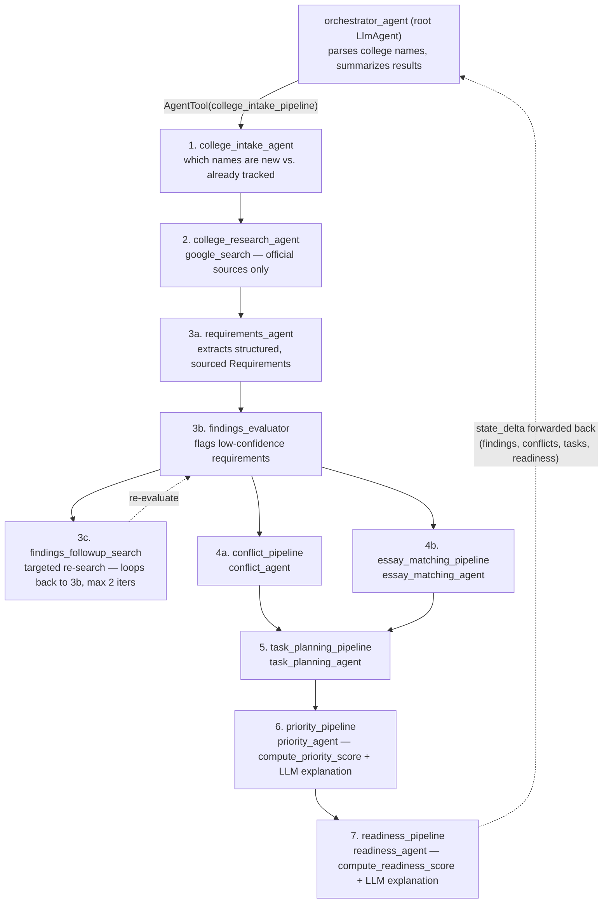

# Architecture

Two views: how the deployed system fits together, and what the agent pipeline
actually does when a student adds colleges.

## System / deployment

One Cloud Run service serves everything — the built React frontend as static
files, the REST API, and the ADK agent runtime (including its A2A surface).
There is no separate frontend host and no second backend.

Notes on choices this reflects (see `.agents-cli-spec.md` for the full
reasoning trail):

- **Why one service, not frontend/backend split.** The ADK scaffold already
  generates a FastAPI app to host the agent runtime; extending it to also
  serve `/api/*` and the built frontend avoids standing up a second service
  just to host CRUD routes and static files (Milestone 17).
- **Why Firestore, not a relational DB.** Every collection lives under
  `users/{userId}/...` — no cross-user joins are ever needed, and the
  document shapes (Requirement, Task, Conflict, ...) map directly onto the
  Pydantic schemas agents already validate against before writing.
- **Why no OAuth yet.** `userId` is a client-generated UUID in
  `localStorage`, sent as a header — an explicit MVP seam that real Google
  auth replaces later, not a security model for production use.
- **Cost shape.** `min-instances=0` (scales to zero between demos),
  `max-instances=3`, `1Gi`/`1 vCPU` — sized for a low-traffic hackathon demo,
  not sustained load.

## Agent pipeline

`orchestrator_agent` is the only agent the frontend talks to directly (via
`POST /api/orchestrator/messages`). It parses which colleges a student
means, then hands off the actual work as a single `AgentTool` call to
`college_intake_pipeline` — a `SequentialAgent` of seven stages — and turns
the result into a plain-language summary. It does no research or extraction
itself.

Stage 3 (`requirements_pipeline`) is itself a `SequentialAgent` wrapping a
`LoopAgent` (`requirements_confidence_loop`, capped at 2 iterations); stage 4
(`cross_college_analysis`) is a `ParallelAgent` — `conflict_pipeline` and
`essay_matching_pipeline` run concurrently, both reading only what stage 3
already wrote, then stage 5 waits for both.

Two things worth calling out that aren't obvious from the shape alone:

- **`conflict_pipeline` and `essay_matching_pipeline` run concurrently**
  (Milestone 11) because neither depends on the other's output — both only
  read `Requirement`/`Recommendation`/`StudentMaterial` docs already written
  by the requirements stage.
- **Scoring is deterministic code, not an LLM guess.** `priority_agent` and
  `readiness_agent` each call a plain-Python formula
  (`compute_priority_score` / `compute_readiness_score` in
  `app/tools/scoring.py`) and only use the LLM to turn the already-computed
  number into a plain-language explanation — the same "business rule in
  code, LLM for judgment" split used throughout.
- **`AgentTool`, not a `sub_agents` transfer**, is what lets control return
  to `orchestrator_agent` after the pipeline finishes instead of ending the
  turn on the pipeline's raw JSON output — and it's why `raw_research_findings`,
  `detected_conflicts`, `planned_tasks`, etc. all land back in the
  Orchestrator's own session state for it to summarize.
