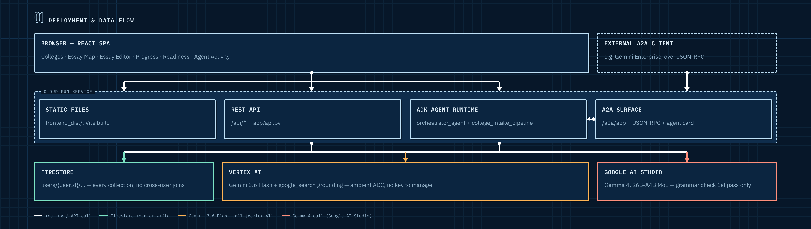
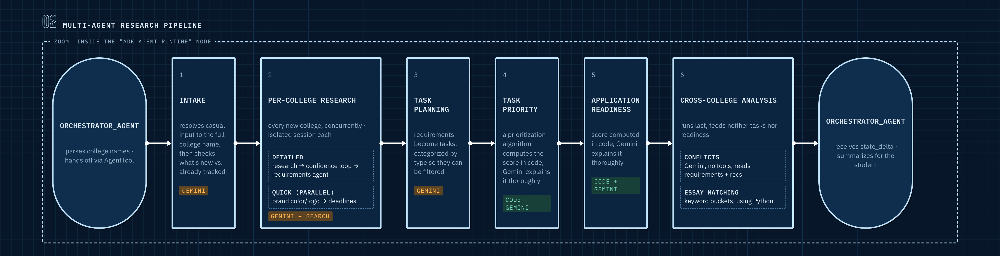
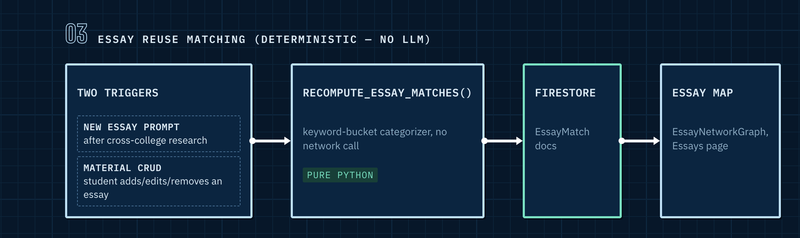
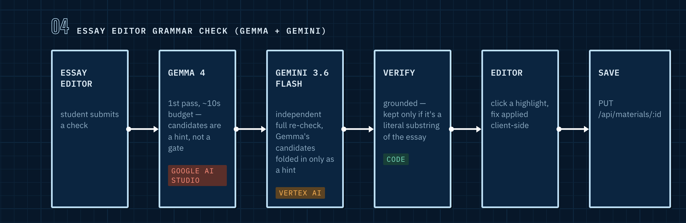

# Architecture

Four views: the deployed system, the college-research agent pipeline, essay
reuse matching (no LLM at all), and the Essay Editor's grammar check (the one
place Gemma runs).

## System / deployment

One Cloud Run service serves everything: the built React frontend as static
files, the REST API, and the ADK agent runtime (including its A2A surface).
There's no separate frontend host and no second backend.

Two different AI backends are in play, not one. **Vertex AI** serves every
Gemini call in the app (the orchestrator, the whole research pipeline, half
of the grammar check). **Google AI Studio** serves Gemma, and only Gemma:
this project's Vertex AI Model Garden access doesn't include Gemma at all
(confirmed live, `client.models.list()` against Vertex lists 24 Gemini
models and zero Gemma ones), so the grammar check's Gemma call goes through
AI Studio via its own API key instead.

Notes on choices this reflects (see `.agents-cli-spec.md` for the full
reasoning trail):

- **Why one service, not frontend/backend split.** The ADK scaffold already
  generates a FastAPI app to host the agent runtime, so it also serves
  `/api/*` and the built frontend rather than standing up a second service.
- **Why Firestore, not a relational DB.** Every collection lives under
  `users/{userId}/...`, no cross-user joins are ever needed, and the
  document shapes map directly onto the Pydantic schemas agents already
  validate against.
- **Why no OAuth yet.** `userId` is a client-generated UUID in
  `localStorage`, sent as a header. An explicit MVP seam, not a security
  model for production.
- **Why two AI backends.** Gemini (Vertex AI, ambient ADC, no key to manage)
  handles everything else. Gemma is only ever called for the Essay Editor's
  first grammar-check pass, through AI Studio's `GEMINI_API_KEY`, and
  doesn't touch any other agent's Vertex/ADC configuration.
- **PDF upload never touches the backend.** Extracting a title/topic/body
  from an uploaded PDF happens entirely client-side (`pdf.js`), before the
  material is ever submitted to `POST /api/materials`.
- **Cost shape.** `min-instances=0`, `max-instances=3`, `1Gi`/`1 vCPU`,
  sized for a low-traffic hackathon demo, not sustained load.

## Agent pipeline (college research)

`orchestrator_agent` is the only agent the frontend talks to directly (via
`POST /api/orchestrator/messages`). It parses which colleges a student
means, hands the actual work to `college_intake_pipeline` as a single
`AgentTool` call, and turns the result into a plain-language summary. It
does no research or extraction itself.

Every college requested in the same message runs stage 2 concurrently, not
one at a time, and within one college its `Detailed` and `Quick` branches
also run concurrently: six workstreams for two colleges, not two.

Worth calling out, since none of this is obvious from the shape alone:

- **Every requested college runs in its own isolated session, concurrently.**
  Batching every college into one shared LLM call hid per-college progress;
  looping one at a time made wait time scale linearly with college count.
  Running each concurrently in its own throwaway session fixed both, with
  nothing for two colleges' writes or citations to collide on.
- **`Detailed` and `Quick` are independently timed-out and retried, not one
  joined unit.** `Quick` (branding, then deadlines) is deliberately the
  fastest possible research, so a college's row can visibly tint before
  deadline queries even start. Splitting them means a stuck `Quick` call
  never forces a retry of the much more expensive `Detailed` pass.
- **`cross_college_analysis` runs last, after Tasks/Priority/Readiness.**
  Neither conflict detection nor essay matching feeds task planning,
  priority, or readiness, so there's no reason for those to sit behind two
  passes that don't feed them.
- **Essay matching is deterministic Python, not an LLM call at all** (see
  the next section). It still runs concurrently with `conflict_pipeline`
  inside `cross_college_analysis`, since neither depends on the other's
  output.
- **Scoring is deterministic code, not an LLM guess.** `priority_agent` and
  `readiness_agent` each call a plain-Python formula in
  `app/tools/scoring.py`, and only use Gemini to turn the already-computed
  number into a plain-language explanation, batched once per stage.
- **`AgentTool`, not a `sub_agents` transfer, is what returns control** to
  `orchestrator_agent` after the pipeline finishes, rather than ending the
  turn on its raw JSON output.

## Essay reuse matching (deterministic, no LLM)

`essay_matching_agent` used to be a two-stage `LlmAgent` pipeline. It's now
a plain Python keyword-bucket categorizer (`app/tools/essay_matching.py`): a
prompt and a material either land in the same broad category (personal
statement, why-this-major, greatest challenge, ...) or they don't, and that
binary match is the actual signal the Essay Map graph needs to draw a
connection, free and instant to compute versus judging thematic overlap
with an LLM call.

Being free is also why it isn't only triggered by a research run. It fires
directly from material CRUD too, so adding an essay connects it to matching
prompts immediately instead of waiting for the next research run.

## Essay Editor grammar check (Gemma + Gemini)

The only place Gemma runs. Triggered directly from the Essays page's Essay
Editor via `POST /api/grammar-check`, a plain REST route
(`app/tools/grammar_check.py`), not an ADK agent and not part of
`college_intake_pipeline`.

Two models, not one, and Gemini always runs regardless of what Gemma
returns:

- **Gemma 4, 26B-A4B-it** (a mixture-of-experts model, 26B total params, ~4B
  active) does a fast first pass. It's genuinely a smaller, less reliable
  model than Gemini at this task.
- **Gemini always runs its own independent detection pass**, not just a
  validator narrowing Gemma's list. An earlier version only asked Gemini to
  narrow Gemma's candidates, so it returned zero issues whenever Gemma's own
  output was empty or unparseable, a frequent outcome for a model this
  small. Now Gemma's candidates are folded in only as a hint, and Gemini is
  told explicitly to check every sentence regardless.
- **Every returned issue is re-verified in Python** against the literal
  essay text before it's shown. An issue whose `original` text isn't a real
  substring of the essay is dropped rather than shown broken.
- Gemma gets its own short ~10s timeout, separate from Gemini's normal 45s
  budget, so a slow or hung Gemma call can't cost the student most of a
  minute before Gemini's real detection pass even starts.
